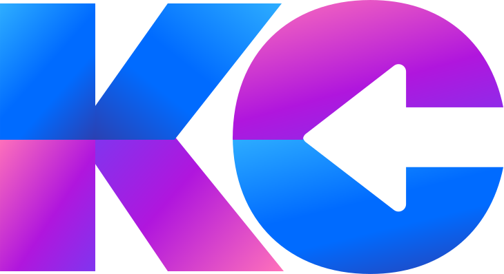

<a name="readme-top"></a>

<div align="center">
  <!-- You are encouraged to replace this logo with your own! Otherwise you can also remove it. -->
  
  <br/>

  <h3><b>Portfolio</b></h3>

</div>

<!-- TABLE OF CONTENTS -->

# 📗 Table of Contents

- [📖 About the Project](#about-project)
  - [🛠 Built With](#built-with)
    - [Tech Stack](#tech-stack)
    - [Key Features](#key-features)
  - [🚀 Live Demo](#live-demo)
- [💻 Getting Started](#getting-started)
  - [Setup](#setup)
  - [Prerequisites](#prerequisites)
  - [Install](#install)
  - [Usage](#usage)
- [👥 Authors](#authors)
- [🔭 Future Features](#future-features)
- [🤝 Contributing](#contributing)
- [⭐️ Show your support](#support)
- [🙏 Acknowledgements](#acknowledgements)
- [📝 License](#license)

<!-- PROJECT DESCRIPTION -->

# 📖 KC Portfolio <a name="about-project"></a>


**KC Portfolio** is a portfolio page that demonstrate my skills in design using Figma. 

## 🛠 Built With <a name="built-with"></a>

### Tech Stack <a name="tech-stack"></a>


<details>
  <summary>HTML</summary>
</details>

<details>
  <summary>CSS</summary>
</details>

<details>
<summary>FIGMA</summary>
  <ul>
    <li><a href="https://www.figma.com/">PostgreSQL</a></li>
  </ul>
</details>

<!-- Features -->

### Key Features <a name="key-features"></a>

- **Resposive page for mobile and desktop user**
- **Visually appealing**
- **Utilize the principles of designs**

<p align="right">(<a href="#readme-top">back to top</a>)</p>

<!-- LIVE DEMO -->

## 🚀 Live Demo <a name="live-demo"></a>

> Add a link to your deployed project.

- [Live Demo Link](https://google.com)

<p align="right">(<a href="#readme-top">back to top</a>)</p>

<!-- GETTING STARTED -->

## 💻 Getting Started <a name="getting-started"></a>


To get a local copy up and running, follow these steps.

### Prerequisites

In order to run this project you need:
```Text editor like VScode.```


### Setup

Clone this repository to your desired folder:

```
  git clone git@github.com:Kccendana/kc_portfolio.git
  cd kc_portfolio
```


### Usage

To run the project, open it through Live Server.


<p align="right">(<a href="#readme-top">back to top</a>)</p>

<!-- AUTHORS -->

## 👥 Author <a name="authors"></a>

> Mention all of the collaborators of this project.

👤 **Katherine Cendana**

- GitHub: [@Kccendana](https://github.com/Kccendana)
- Twitter: [@kc_telyn](https://twitter.com/kc_telyn)
- LinkedIn: [LinkedIn](https://www.linkedin.com/in/katherinecendana/)


<p align="right">(<a href="#readme-top">back to top</a>)</p>

<!-- FUTURE FEATURES -->

## 🔭 Future Features <a name="future-features"></a>


- [ ] **Animated elements in the page.**
- [ ] **User-friendly and interactive**

<p align="right">(<a href="#readme-top">back to top</a>)</p>

<!-- CONTRIBUTING -->

## 🤝 Contributing <a name="contributing"></a>

Contributions, issues, and feature requests are welcome!

Feel free to check the [issues page](../../issues/). You are also welcome to contibute on the page. 

<p align="right">(<a href="#readme-top">back to top</a>)</p>

<!-- SUPPORT -->

## ⭐️ Show your support <a name="support"></a>


If you like this project please give me a star and follow my page.

<p align="right">(<a href="#readme-top">back to top</a>)</p>

<!-- ACKNOWLEDGEMENTS -->

## 🙏 Acknowledgments <a name="acknowledgements"></a>


I would like to thank Microverse for another wonderful project and learning. I would also give thanks in advance the code reviewer who helps me be a better developer.

<p align="right">(<a href="#readme-top">back to top</a>)</p>

<!-- FAQ (optional) -->


<!-- LICENSE -->

## 📝 License <a name="license"></a>

This project is [MIT](MIT.md) licensed.

_NOTE: we recommend using the [MIT license](https://choosealicense.com/licenses/mit/) - you can set it up quickly by [using templates available on GitHub](https://docs.github.com/en/communities/setting-up-your-project-for-healthy-contributions/adding-a-license-to-a-repository). You can also use [any other license](https://choosealicense.com/licenses/) if you wish._

<p align="right">(<a href="#readme-top">back to top</a>)</p>
